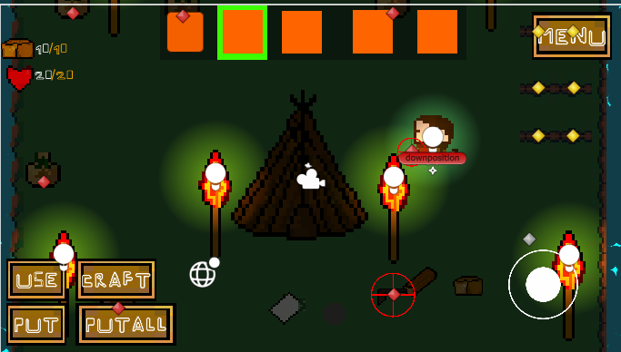
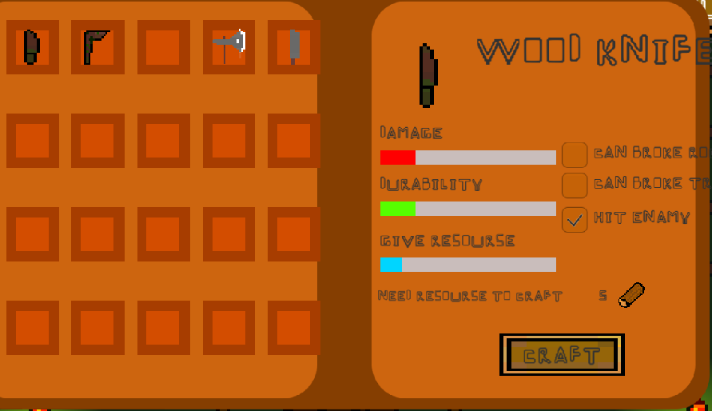
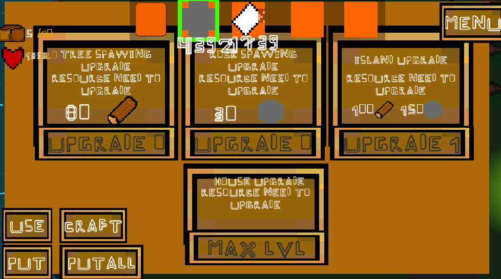

# 🏝️ Survival on Island

2D top-down survival-гра на Unity, де гравець потрапляє на процедурно згенерований острів, добуває ресурси, крафтить спорядження, будує та прокачує свою базу, відбивається від ворогів і намагається вижити.

Керування адаптоване під сенсорні екрани (віртуальний джойстик), тож гра орієнтована в першу чергу на мобільні пристрої.

## 📸 Скріншоти

### Ігровий процес
Видобуток ресурсів, інвентар, хотбар предметів і взаємодія зі світом (дерева, вогнище, база).



### Крафт
Система крафту предметів з характеристиками (шкода, міцність, кількість ресурсу, який дає предмет) та необхідними ресурсами для створення.



### Прокачка бази
Апгрейди острова: пришвидшення спавну дерев і каміння, прокачка острова та будинку за ресурси.



## ✨ Основні можливості

- 🌴 Процедурна генерація острова (`genereteisland.cs`)
- 🌳 Видобуток ресурсів з дерев і каменю, що відновлюються (`Tree.cs`, `generateresourse.cs`)
- 🎒 Інвентар та хотбар предметів (`Invantory.cs`, `hotbar.cs`, `item.cs`, `itemstuck.cs`)
- 🛠️ Крафтинговий стіл із рецептами та характеристиками предметів (`createtable.cs`, `opentable.cs`)
- 🏠 Будівництво й прокачка бази/острова/будинку (`Base.cs`, `upgradeislandd.cs`, `OpenBaseMenu.cs`)
- ⚔️ Бойова система та анімації атаки/бігу/очікування (`Attack.cs`, `Attack.anim`, `run.anim`, `Stay.anim`)
- 🔥 Вогнище/крафт-станція (`fire.cs`)
- 💾 Збереження прогресу гравця та бази (`SaveItemPlayer.cs`, `savebase.cs`)
- 🕹️ Мобільне керування через віртуальний джойстик ([Joystick Pack](Assets/Joystick%20Pack))
- 📋 Меню гри та UI (`Menu.cs`, `Open_close_menu.cs`)

## 🧱 Технології

- **Unity** 2023.2.20f1
- **C#** — вся ігрова логіка
- **TextMesh Pro** — текст та UI
- **Joystick Pack** — керування для сенсорних екранів

## 📂 Структура проєкту

```
survival-on-island/
├── Assets/
│   ├── C#/                # Скрипти ігрової логіки
│   ├── Animation/         # Анімації гравця, світла, тексту
│   ├── Scenes/            # menu.unity, game.unity
│   ├── Prefebs/           # Префаби острова та інших об'єктів
│   ├── UI Prefabs/        # Префаби інтерфейсу
│   ├── Joystick Pack/     # Віртуальний джойстик
│   ├── TextMesh Pro/      # Шрифти та стилі тексту
│   ├── Tree_Textures/     # Текстури дерев
│   ├── Material/, Shaders/, Images/, icon/
├── Packages/              # Unity Package Manager залежності
├── ProjectSettings/       # Налаштування Unity-проєкту
└── survival_screenshots/  # Скріншоти геймплею
```

## 🚀 Запуск проєкту

1. Встановіть [Unity Hub](https://unity.com/download) та Unity версії **2023.2.20f1** (або сумісну).
2. Клонуйте репозиторій:
   ```bash
   git clone https://github.com/xvt1/survival-on-island.git
   ```
3. Відкрийте проєкт через Unity Hub, вказавши шлях до склонованої папки.
4. Відкрийте сцену `Assets/Scenes/menu.unity` або одразу `Assets/Scenes/game.unity`.
5. Натисніть **Play**, щоб запустити гру у редакторі.

## 🎮 Керування

- Переміщення — віртуальний джойстик (зліва)
- Взаємодія з об'єктами — кнопки **USE / CRAFT / PUT / PUTALL**
- Хотбар — вибір активного предмета зі слотів у верхній частині екрана
- Меню — кнопка **MENU** у правому верхньому куті

## 🗺️ Плани на майбутнє

> Розділ можна доповнити актуальним планом розвитку проєкту — наприклад, новими видами ворогів, біомами, кооперативом тощо.

## 📄 Ліцензія

Ліцензію для проєкту ще не вказано. За потреби додайте файл `LICENSE` з обраною ліцензією (MIT, GPL тощо).
